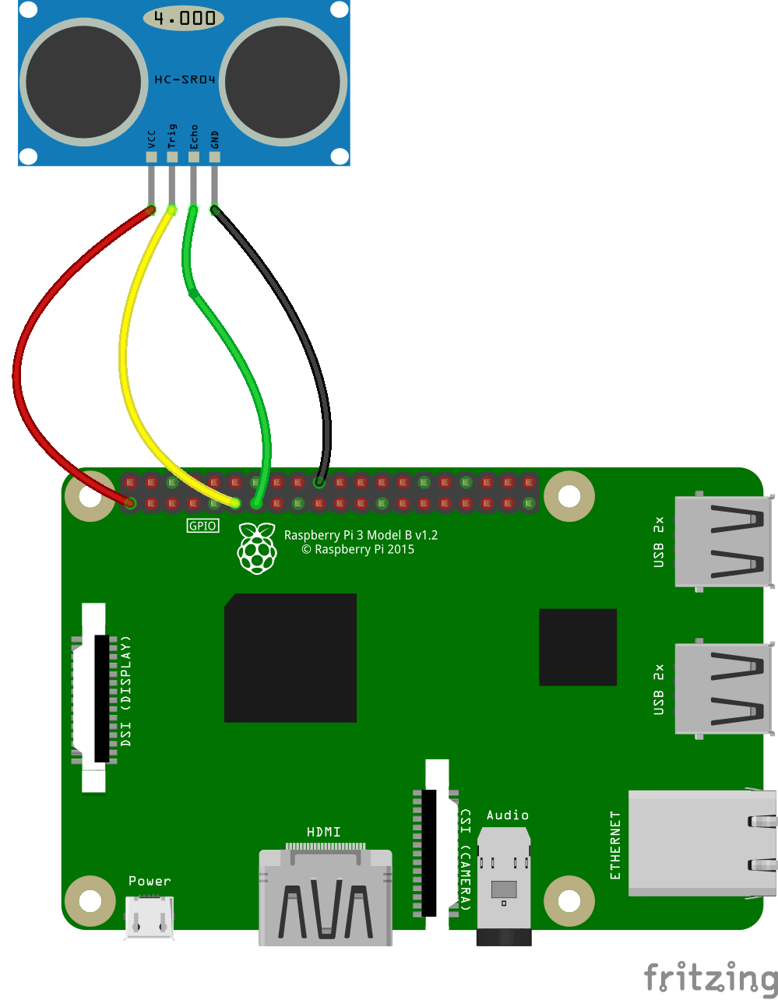

## Setting up the distance sensor

An ultrasonic distance sensor is a device that sends out pulses of ultrasonic sound, and measures the time they take to bounce off nearby objects and be reflected back. They can measure distances fairly accurately, up to about a metre.

Make sure that the distance sensor you are using for this project can be used with a 3.3V power supply.

An ultrasonic distance sensor has four pins. They are called **Ground** (**Gnd**), **Trigger** (**Trig**), **Echo** (**Echo**), and **Power** (**Vcc**).

To use an ultrasonic distance sensor you need to connect the **Gnd** pin to the ground pin on the Raspberry Pi, the **Trig** and **Echo** pins to GPIO pins on the Raspberry Pi and the **Vcc** pin to the 3V3 pin on the Raspberry Pi.

--- task ---
Use four female-to-female jumper leads to wire up the distance sensor directly to the Raspberry Pi.

The diagram below shows one suggested arrangement for setting this up with the `echo` pin connected to `GPIO 17` and the `trigger` pin connected to `GPIO 27`:

--- /task ---

