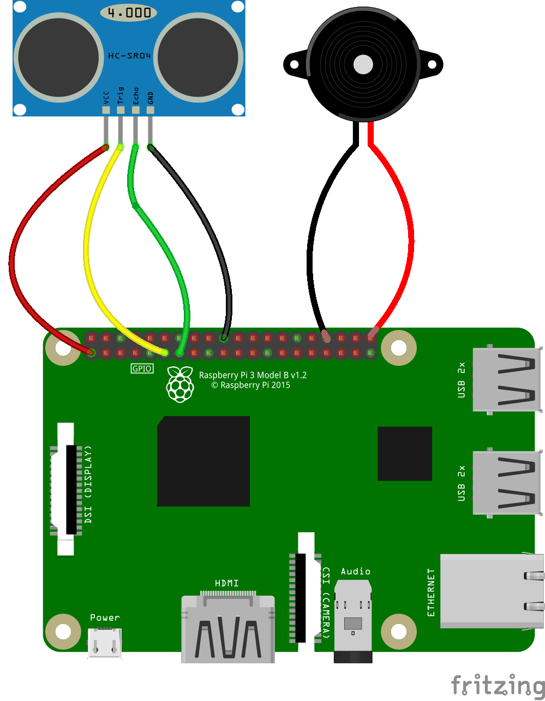

## Adding a buzzer

Now that you can tell how far away your hand is from the distance sensor, it is time to add a buzzer.

--- task ---
Connect your buzzer directly to the Raspberry Pi, using two female-to-female jumper leads. Here it is shown connected to `GPIO 21` and a `GND` pin

--- /task ---

--- task ---
You can now set up the buzzer in your `theremin.py` file.

--- code ---
---
language: python
filename: theremin.py
line_numbers: true
line_number_start: 
highlight_lines: 1,2,6
---
from gpiozero import DistanceSensor, TonalBuzzer
from gpiozero.tones import Tone
from time import sleep

uds = DistanceSensor(trigger=27, echo=17)
buzzer = TonalBuzzer(21, octaves=3)

while True:
	print(sensor.distance)
	sleep(1)
--- /code ---
--- /task ---

Here the buzzer has been set up have a range of three octaves above and below it's middle value (midi note 69).

--- task ---
You can test your buzzer works by playing a single note in your `while True` loop.

--- code ---
---
language: python
filename: theremin.py
line_numbers: true
line_number_start: 
highlight_lines: 10
---
from gpiozero import DistanceSensor, TonalBuzzer
from gpiozero.tones import Tone
from time import sleep

uds = DistanceSensor(trigger=27, echo=17)
buzzer = TonalBuzzer(21, octaves=3)

while True:
	print(sensor.distance)
	buzzer.play(Tone(midi=69))
	sleep(1)
--- /code ---

Change your code and then run the file.
--- /task ---
