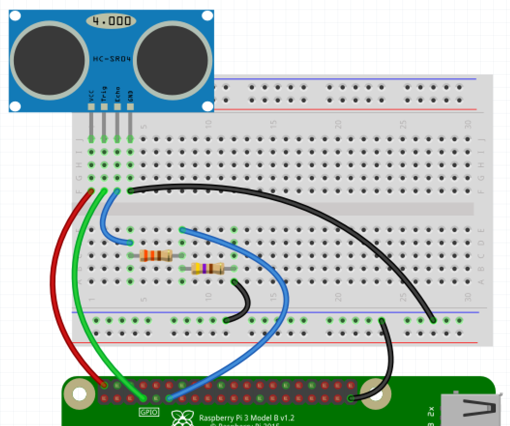

# The Raspberry Pi ultrasonic theremin

In this resource, you are going to make your very own theremin using an ultrasonic distance sensor and a little bit of Python and Sonic Pi code.


	<a href="https://en.wikipedia.org/wiki/User:G2pavlov" class="extiw" title="en:User:G2pavlov">G2pavlov</a> at the <a href="https://en.wikipedia.org/wiki/" class="extiw" title="w:">English language Wikipedia</a> [<a href="http://www.gnu.org/copyleft/fdl.html">GFDL</a> or <a href="http://creativecommons.org/licenses/by-sa/3.0/">CC-BY-SA-3.0</a>], <a href="https://commons.wikimedia.org/wiki/File%3ALydia_kavina.jpg">via Wikimedia Commons</a>

A [theremin](https://en.wikipedia.org/wiki/Theremin) is a unique musical instrument, in that it produces sound without being touched by the performer. The circuitry for a theremin is fairly complicated, but you can fake it by using ultrasonic distance sensors.

## Setting up the circuitry.

An ultrasonic distance sensor is a device that sends out pulses of ultrasonic sound, and measures the time they take to bounce off nearby objects and be reflected back. They can measure distances fairly accurately, up to about a meter.


An ultrasonic distance sensor has four pins. They are called *Ground* (`Gnd`), *Trigger* (`Trig`), *Echo* (`Echo`) and *Power* (`Vcc`).

To use an ultrasonic distance sensor you need to connect the `Gnd` pin to the ground pin on the Raspberry Pi, the `Trig` pin to a GPIO pin on the Raspberry Pi and the `Vcc` pin to the 5V pin on the Raspberry Pi.

The `Echo` pin is a little more complicated. It needs to be connected through a 330 ohm resistor to a GPIO pin on the Raspberry Pi, and that pin needs to be grounded through a 470 ohm resistor.

The diagram below shows one arrangement you can use to set this up.



## Detecting distance.

Thanks to the abstractions in the GPIO Zero module, you can very easily detect how far away an object is from the distance sensor. If you've wired up the sensor as shown in the diagram, then your echo pin is **17** and your trigger pin is **4**.

1. Click on `Menu` > `Programming` > `Python 3 (IDLE)`, to open up a new Python shell.
1. In the *shell* click on `New` > `New File` to create a new Python file.
1. The code to detect a distance is below. Type it into your new file, then save and run it.

	```python
	from gpiozero import DistanceSensor
	from time import sleep

	sensor = DistanceSensor(echo=17, trigger=4)

	while True:
		print(sensor.distance)
		sleep(1)
	```

The `sensor.distance` is the distance in meters an object is from the sensor. Run your code and move your hand back and forth infront of the sensor. You should see the distance changing, as it's printed out in the shell.

## Getting Sonic Pi ready

Sonic Pi is going to receive messages from your running Python script. This will tell Sonic Pi which note needs to be played.

1. Open Sonic Pi by clicking on `Menu` > `Programming` > `Sonic Pi`
1. In the buffer that is open, you can begin by writing a `live_loop`. This is a loop that will run forever, but can easily be updated allowing you to experiment with different sounds.

	```ruby
	live_loop :listen do

	end
	```

1. Next you can sync the `live_loop` with the messages that will be coming from Python.

	```ruby
	live_loop :listen do
		message = sync "/play_this"
	end
	```

1. The message that comes in will be a dictionary, containing the `key` `:args`. The value of this key will be a `list` where the first item is the midi value of the note to be played.

	```ruby
	live_loop :listen do
		message = sync "/play_this"
		note = message[:args][0]
	end
	```

1. Lastly you need to play the note.

```ruby
live_loop :listen do
    message = sync "/play_this"
	note = message[:args][0]
	play note
end
```

1. You can set this live loop to play straight away, by clicking on the `Run` button. You won't hear anything yet, as the loop is not receiving any messages.

## Sending notes from Python

To finish off your program, you need to send note midi values to Sonic Pi from your Python file.

1. You'll need to use the osc library for this part. There are two imports to be added to the top of your file, to allow Python to send messages.

	```python
	from gpiozero import DistanceSensor
	from time import sleep

	from pythonosc import osc_message_builder
	from pythonosc import udp_client

	sensor = DistanceSensor(echo=17, trigger=4)

	while True:
		print(sensor.distance)
		sleep(1)
	```

1. Now you need to create a `sender` object that can send the message.

	```python
	from gpiozero import DistanceSensor
	from time import sleep

	from pythonosc import osc_message_builder
	from pythonosc import udp_client

	sensor = DistanceSensor(echo=17, trigger=4)
	sender = udp_client.SimpleUDPClient('127.0.0.1', 4559)

	while True:
		print(sensor.distance)
		sleep(1)
	```

1. You need to convert the Distance into a Midi value. These should integers (whole numbers) and hover around the value 60 which is middle C. To do this you need to round the distance, multiply it by 100 and then add a little bit, so the note is not too low in pitch.

	```python
	from gpiozero import DistanceSensor
	from time import sleep

	from pythonosc import osc_message_builder
	from pythonosc import udp_client

	sensor = DistanceSensor(echo=17, trigger=4)
	sender = udp_client.SimpleUDPClient('127.0.0.1', 4559)

	while True:
		pitch = round(sensor.distance * 100 + 30)
		sleep(1)
	```

1. To finish off, you need to send the pitch over to Sonic Pi, and reduce the sleep time.

	```python
	from gpiozero import DistanceSensor
	from time import sleep

	from pythonosc import osc_message_builder
	from pythonosc import udp_client

	sensor = DistanceSensor(echo=17, trigger=4)
	sender = udp_client.SimpleUDPClient('127.0.0.1', 4559)

	while True:
		pitch = round(sensor.distance * 100 + 30)
		sender.send_message('/play_this', pitch)
		sleep(0.1)
	```

1. Save an run your code and see what happens. If all goes well, you've made your very own theremin.

## What Next?

- A real theremin has a secondary control to change the amplitude (volume) of the tone being played. You could do this with a second Ultrasonic distance sensor.

- What happens if you change the timing in the Python file? Can you get a smoother transition of notes.

- Have a play with different synths, as shown in the Sonic Pi help menu. What effect does changing the synth have on your theremin?
